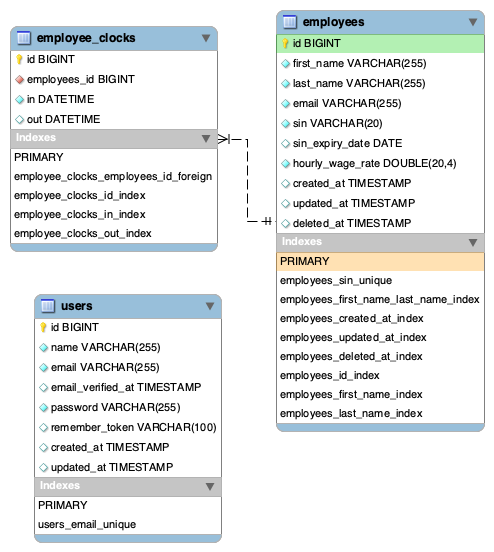

# ERD



# Commands to execute on your machine

```sh
docker-compose build
docker-compose up -d
docker exec -it employee-app bash -c "sudo -u devuser /bin/bash"
```

# Commands to execute inside of employee-app container

```sh
composer install
php artisan config:cache --env=local
php artisan migrate:install
php artisan migrate:fresh --seed
```

# Test commands to execute inside of employee-app container

```sh
php artisan config:cache --env=testing
php artisan test
./vendor/bin/codecept run api
```
